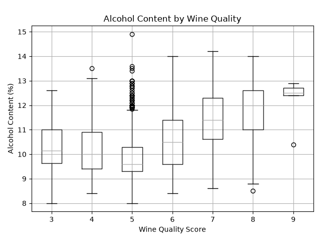

# Wine Quality Data Analysis

## Project Goal

The goal of this project is to explore the merged red and white wine quality dataset using Pandas and Polars. The analysis examines differences between red and white wines, investigates relationships between physicochemical properties and wine quality, and uses a machine learning model to predict wine quality.

This project includes:

- Dataset inspection and data quality checks
- Filtering and grouping
- Data visualization
- Machine learning exploration using Random Forest Regression
- A performance comparison between Pandas and Polars
- Unit and integration testing using pytest
- Continuous integration using GitHub Actions

## Dataset

The dataset used in this project is the **Red and White Wine Quality** dataset from Kaggle.

**Source:**  
https://www.kaggle.com/datasets/amirmohamadrezaie/red-and-white-wine-quality

The dataset contains **6,497 wine samples and 13 columns**. It combines red and white wine samples and includes 11 physicochemical measurements, a wine quality score, and a wine type (`red` or `white`).

The 11 physicochemical features are:

- Fixed acidity
- Volatile acidity
- Citric acid
- Residual sugar
- Chlorides
- Free sulfur dioxide
- Total sulfur dioxide
- Density
- pH
- Sulphates
- Alcohol

The `quality` column contains integer quality scores ranging from 3 to 9 and is used as the target variable for the machine learning experiment.

## Setup Instructions

This project was developed using **Python 3.12**.

Install the required Python packages from `requirements.txt`:

```bash
python -m pip install -r requirements.txt
```

Run the analysis from the project directory:

```bash
python main.py
```

The script performs data inspection, data quality checks, filtering and grouping, visualization, machine learning analysis, and a Pandas/Polars performance comparison.

## Data Inspection and Quality

The dataset was first inspected using Pandas.

- `head()` was used to view the first five rows.
- `info()` was used to inspect column data types and non-null counts.
- `describe()` was used to examine summary statistics for the numerical variables.

The dataset contains **6,497 rows and 13 columns**. The 11 physicochemical measurements are stored as floating-point values, `quality` is stored as an integer, and `type` identifies each sample as red or white wine.

Basic data quality checks were also performed to examine the completeness and integrity of the dataset.

### Missing Values

No missing values were found in any of the 13 columns.

### Duplicate Rows

A total of **1,177 rows** were identified as duplicates based on identical values across all columns.

These rows were retained in the analysis because the dataset does not contain a unique sample identifier. Therefore, identical rows cannot be confidently determined to be erroneous duplicate records rather than separate samples with identical recorded measurements.

## Filtering and Grouping

### High-Quality Wines

Wines with a quality score of **7 or higher** were filtered and treated as high-quality wines for this analysis.

A total of **1,277 samples** met this condition, representing approximately **19.7%** of the dataset.

### Red vs. White Wine

The dataset was grouped by wine type to compare selected average characteristics.

| Characteristic | Red Wine | White Wine |
| --- | ---: | ---: |
| Quality | 5.636 | 5.878 |
| Alcohol | 10.423 | 10.514 |
| pH | 3.311 | 3.188 |
| Residual Sugar | 2.539 | 6.391 |
| Volatile Acidity | 0.528 | 0.278 |

The average quality and alcohol content of red and white wines are relatively similar. However, larger differences appear in some physicochemical measurements. White wines have substantially higher average residual sugar, while red wines have higher average volatile acidity.

## Visualization

A boxplot was created to compare alcohol content across wine quality scores.



A boxplot was selected because wine quality is represented by discrete integer scores while alcohol content is a continuous variable. The boxplot makes it easy to compare the distribution and median alcohol content across the different quality levels while also showing variability and potential outliers.

The visualization shows a general positive relationship between alcohol content and wine quality. In particular, wines with higher quality scores tend to have higher median alcohol content, although the distributions overlap across quality levels.

This pattern represents an association in the dataset and does not imply that higher alcohol content causes higher wine quality.

## Machine Learning Exploration

A **Random Forest Regressor** was used to explore whether the 11 physicochemical measurements could be used to predict wine quality.

### Model Inputs and Output

The model inputs were the following 11 features:

- Fixed acidity
- Volatile acidity
- Citric acid
- Residual sugar
- Chlorides
- Free sulfur dioxide
- Total sulfur dioxide
- Density
- pH
- Sulphates
- Alcohol

The model output was:

- `quality`

The `type` column was not included as an input feature in this initial experiment. This allowed the model to focus on the measured physicochemical properties of each wine.

### Train/Test Split

The dataset was divided into:

- **80% training data:** 5,197 samples
- **20% testing data:** 1,300 samples

A fixed random state was used to make the split reproducible.

### Model Performance

The Random Forest model achieved:

- **Mean Absolute Error (MAE): 0.438**
- **R-squared (R²): 0.497**

The MAE indicates that the predicted quality score differed from the actual quality score by approximately **0.44 points on average**.

The R² score indicates that the model captured some meaningful variation in wine quality using the physicochemical measurements, although a substantial portion of the variation remains unexplained.

### Feature Importance

The three most important features identified by the Random Forest were:

| Feature | Importance |
| --- | ---: |
| Alcohol | 0.255 |
| Volatile Acidity | 0.128 |
| Free Sulfur Dioxide | 0.090 |

Alcohol was the most important feature in the Random Forest model. This is consistent with the pattern observed in the boxplot, where higher-quality wines generally had higher median alcohol content.

Feature importance represents the usefulness of a variable to this predictive model and should not be interpreted as evidence of a causal relationship.

## Pandas vs. Polars

Pandas and Polars were compared using the same data-processing task:

1. Read the CSV dataset.
2. Group the wines by `type`.
3. Calculate the average alcohol content for each wine type.

Both libraries produced the same results:

- **Red wine average alcohol:** 10.422983
- **White wine average alcohol:** 10.514267

To reduce the effect of variation from a single timing measurement, the operation was repeated **five times**, and the average execution time was calculated.

| Library | Average Execution Time |
| --- | ---: |
| Pandas | 0.013798 seconds |
| Polars | 0.006744 seconds |

In this experiment, Polars completed the operation faster on average than Pandas. However, the dataset contains only 6,497 rows and the benchmark covers only one small data-processing workload. Therefore, this result should not be generalized to all datasets or workloads. Larger datasets and more extensive benchmarking would be needed for a broader performance comparison.

## Key Findings

The main findings from this analysis are:

- The dataset contains no missing values.
- 1,177 potentially duplicate rows were identified, but they were retained because no unique sample identifier is available.
- 1,277 wines, or approximately 19.7% of the dataset, have a quality score of 7 or higher.
- White wines have substantially higher average residual sugar than red wines.
- Red wines have higher average volatile acidity than white wines.
- Higher wine quality scores generally correspond to higher median alcohol content.
- Alcohol was the most important feature identified by the Random Forest model.
- The Random Forest achieved an MAE of 0.438 and an R² of 0.497 on the test set.
- Pandas and Polars produced the same group-level results, while Polars was faster on average in the five-run performance experiment.

## Testing

The project uses `pytest` to validate the core functionality of the data analysis workflow.

The test suite includes five unit tests covering:

- Dataset loading and expected structure
- Missing-value and duplicate detection
- Filtering and grouping operations
- Random Forest model training and evaluation
- Visualization output

An additional integration test validates the core workflow from loading the dataset through data quality checks, analysis, and machine learning model training.

Run all tests from the project directory with:

```bash
python -m pytest -v
```

The current test suite contains **6 tests**, and all tests pass successfully.

## Continuous Integration

GitHub Actions is configured to automatically run the test suite whenever changes are pushed to the `main` branch or a pull request targets `main`.

The CI workflow:

1. Checks out the repository.
2. Sets up Python 3.12.
3. Installs the dependencies from `requirements.txt`.
4. Runs all tests using `pytest`.

The workflow configuration is located at:

```text
.github/workflows/tests.yml
```

## Project Files

- `main.py` - Performs the Pandas analysis, data quality checks, filtering and grouping, visualization, machine learning experiment, and Pandas/Polars comparison.
- `wine_quality_merged.csv` - Dataset used for the analysis.
- `alcohol_by_quality.png` - Boxplot showing alcohol content across wine quality scores.
- `tests/test_main.py` - Unit tests for the major analysis functions.
- `tests/test_integration.py` - Integration test for the core analysis workflow.
- `requirements.txt` - Python dependencies required to reproduce the project.
- `.github/workflows/tests.yml` - GitHub Actions workflow for automated testing.
- `rust_vs_python_intro.ipynb` - Rust exercises and experiments with mutability, ownership, cloning, and borrowing.
- `README.md` - Project documentation.