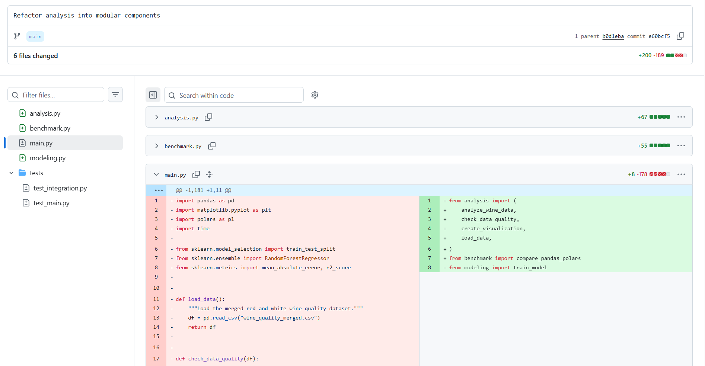
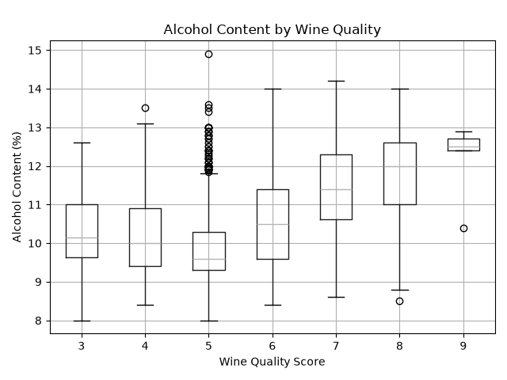
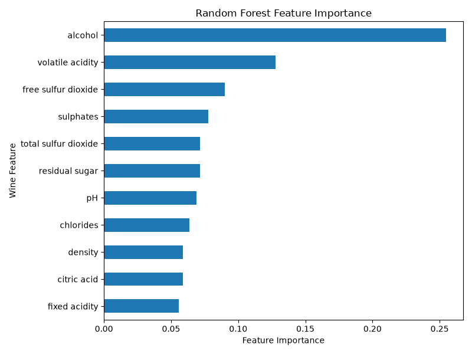
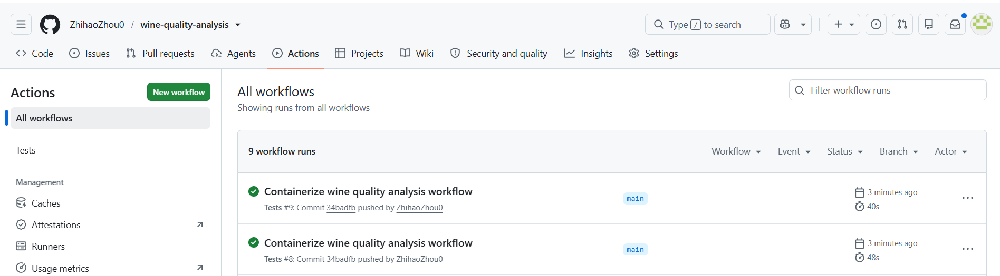
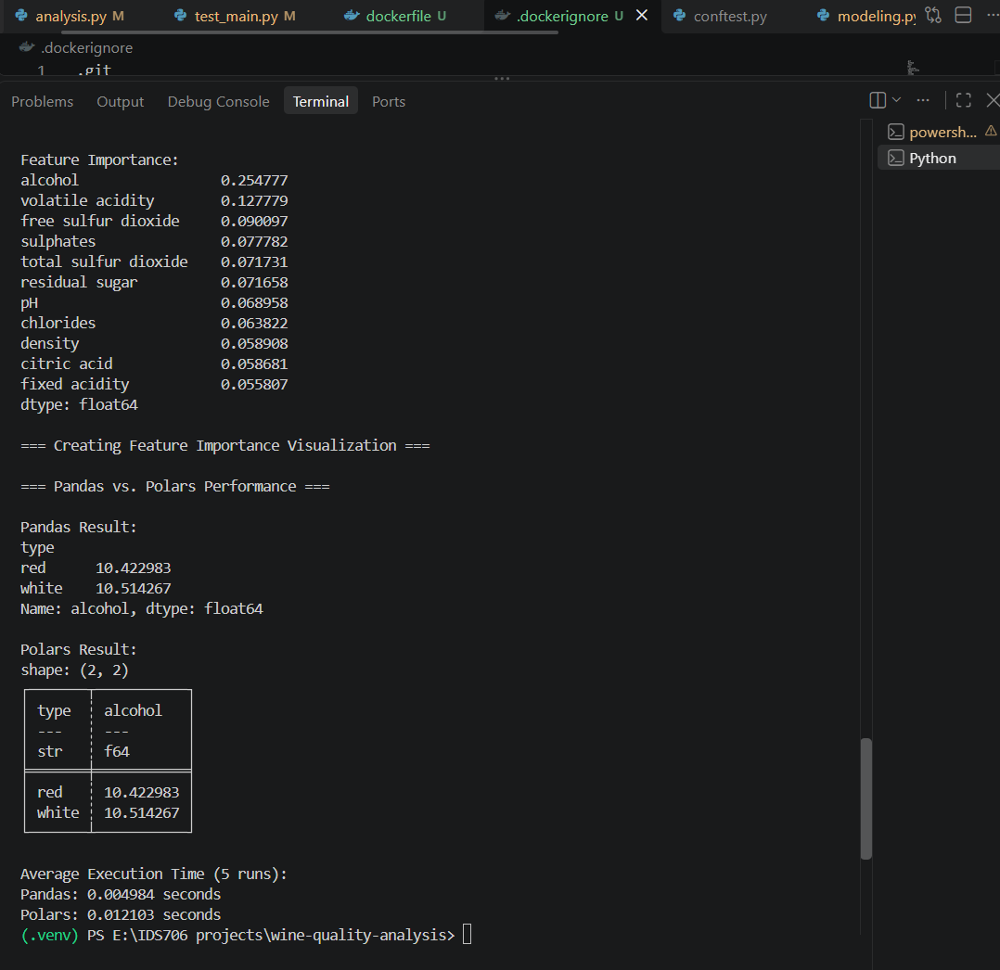

# Wine Quality Data Analysis

[](https://github.com/ZhihaoZhou0/wine-quality-analysis/actions/workflows/tests.yml)

## Project Overview

This project analyzes a merged red and white wine quality dataset using Python, Pandas, Polars, data visualization, and machine learning.

The project began as a basic exploratory data analysis and was progressively refactored into a modular, tested, containerized, and reproducible data analysis workflow.

The project includes:

- Data inspection and data quality validation
- Duplicate and missing-value analysis
- IQR-based potential outlier detection
- Filtering and grouped statistical analysis
- Data visualization
- Random Forest regression
- Feature importance analysis
- Pandas and Polars performance comparison
- Modular Python architecture
- Unit and integration testing with pytest
- Automated formatting with Black
- Static code analysis with Flake8
- Continuous integration across Python 3.11 and 3.12
- Docker containerization for reproducible execution

---

## Dataset

The project uses the **Red and White Wine Quality** dataset from Kaggle.

**Source:**  
https://www.kaggle.com/datasets/amirmohamadrezaie/red-and-white-wine-quality

The merged dataset contains **6,497 wine samples and 13 columns**. It includes 11 physicochemical measurements, a wine quality score, and a wine type (`red` or `white`).

The 11 physicochemical features are:

- Fixed acidity
- Volatile acidity
- Citric acid
- Residual sugar
- Chlorides
- Free sulfur dioxide
- Total sulfur dioxide
- Density
- pH
- Sulphates
- Alcohol

The `quality` column contains integer quality scores ranging from 3 to 9 and serves as the target variable in the machine learning experiment.

---

## Project Architecture

The analysis was refactored from a primarily monolithic script into separate modules with clearly defined responsibilities.

```text
wine-quality-analysis/
├── .github/
│   └── workflows/
│       └── tests.yml
├── images/
│   ├── ci-matrix-results.png
│   ├── docker-run-results.png
│   ├── github-actions-results.png
│   ├── pytest-results.png
│   └── refactoring-diff.png
├── tests/
│   ├── conftest.py
│   ├── test_integration.py
│   └── test_main.py
├── .dockerignore
├── Dockerfile
├── analysis.py
├── benchmark.py
├── main.py
├── modeling.py
├── requirements.txt
├── wine_quality_merged.csv
├── alcohol_by_quality.png
├── feature_importance.png
└── README.md
```

The main modules are:

- `analysis.py` — data loading, data quality checks, outlier detection, grouped analysis, and visualization
- `modeling.py` — Random Forest training, evaluation, and feature importance visualization
- `benchmark.py` — Pandas and Polars performance comparison
- `main.py` — orchestration of the complete analysis workflow

This structure separates data analysis, modeling, benchmarking, and workflow orchestration, making the project easier to test, maintain, and extend.

### Refactoring Evidence

The following GitHub commit diff shows the refactoring of the original analysis into separate modules:



---

## Setup

This project supports **Python 3.11 and Python 3.12** through the continuous integration workflow and uses Python 3.12 as the Docker runtime.

Install the required packages:

```bash
python -m pip install -r requirements.txt
```

Run the complete analysis:

```bash
python main.py
```

The workflow performs:

1. Dataset loading and inspection
2. Data quality checks
3. Potential outlier detection
4. Filtering and grouped analysis
5. Alcohol-content visualization
6. Random Forest model training and evaluation
7. Feature importance visualization
8. Pandas vs. Polars benchmarking

---

## Data Quality

### Missing Values

No missing values were found in any of the 13 columns.

### Duplicate Rows

A total of **1,177 rows** were identified as duplicates based on identical values across all columns.

The rows were retained because the dataset does not contain a unique sample identifier. Therefore, identical rows cannot be confidently classified as erroneous duplicates rather than separate samples with identical recorded measurements.

### Potential Outliers

Potential outliers in the continuous physicochemical features were identified using the **1.5 × IQR rule**.

The `quality` target was excluded from this process because it is an ordinal score rather than a continuous physicochemical measurement.

| Feature | Potential Outliers |
| --- | ---: |
| Citric acid | 509 |
| Volatile acidity | 377 |
| Fixed acidity | 357 |
| Chlorides | 286 |
| Sulphates | 191 |
| Residual sugar | 118 |
| pH | 73 |
| Free sulfur dioxide | 62 |
| Total sulfur dioxide | 10 |
| Density | 3 |
| Alcohol | 3 |

These observations were **retained rather than automatically removed**. Extreme chemical measurements may represent valid wines, and the IQR rule identifies statistical extremes rather than proving that a record is erroneous.

---

## Exploratory Analysis

### High-Quality Wines

Wines with a quality score of **7 or higher** were treated as high-quality wines.

A total of **1,277 samples**, approximately **19.7%** of the dataset, met this condition.

### Red vs. White Wine

Selected average characteristics were compared after grouping the dataset by wine type.

| Characteristic | Red Wine | White Wine |
| --- | ---: | ---: |
| Quality | 5.636 | 5.878 |
| Alcohol | 10.423 | 10.514 |
| pH | 3.311 | 3.188 |
| Residual Sugar | 2.539 | 6.391 |
| Volatile Acidity | 0.528 | 0.278 |

Average quality and alcohol content are relatively similar between the two wine types. Larger differences appear in other measurements: white wines have substantially higher average residual sugar, while red wines have higher average volatile acidity.

---

## Visualization

A boxplot was created to compare alcohol content across wine quality scores.



A boxplot is useful here because wine quality consists of discrete integer scores while alcohol content is continuous.

The visualization shows a general positive association between alcohol content and wine quality. Higher quality scores tend to correspond to higher median alcohol content, although the distributions overlap substantially.

This is an association observed in the dataset and should not be interpreted as evidence that alcohol content causes higher wine quality.

---

## Machine Learning

A **Random Forest Regressor** was used to explore how effectively the 11 physicochemical measurements could predict wine quality.

### Model Inputs

The model uses:

- Fixed acidity
- Volatile acidity
- Citric acid
- Residual sugar
- Chlorides
- Free sulfur dioxide
- Total sulfur dioxide
- Density
- pH
- Sulphates
- Alcohol

The prediction target is:

```text
quality
```

The `type` column was not included in this initial experiment, allowing the model to focus on measured physicochemical properties.

### Train/Test Split

The dataset was divided into:

- **Training:** 5,197 samples (80%)
- **Testing:** 1,300 samples (20%)

A fixed random state was used to make the experiment reproducible.

### Model Performance

The Random Forest achieved:

- **Mean Absolute Error (MAE): 0.438**
- **R-squared (R²): 0.497**

The MAE indicates that predicted quality scores differed from actual quality scores by approximately **0.44 points on average**.

The R² indicates that the model captured meaningful variation in wine quality using the available physicochemical measurements, although substantial variation remains unexplained.

### Feature Importance

The Random Forest feature importance analysis identified alcohol as the strongest feature in the model.



The three highest feature importance values were:

| Feature | Importance |
| --- | ---: |
| Alcohol | 0.255 |
| Volatile Acidity | 0.128 |
| Free Sulfur Dioxide | 0.090 |

The importance of alcohol is consistent with the exploratory boxplot, where higher-quality wines generally show higher median alcohol content.

Feature importance describes how useful a feature was to this particular predictive model and should not be interpreted as a causal effect.

---

## Pandas vs. Polars Benchmark

Pandas and Polars were compared using the same operation:

1. Read the CSV dataset
2. Group observations by `type`
3. Calculate average alcohol content for each wine type

Both libraries produced the same analytical result:

- **Red wine average alcohol:** 10.422983
- **White wine average alcohol:** 10.514267

The benchmark is repeated **five times**, and the average execution time is reported.

Timing results vary across runs and environments. Because the dataset contains only 6,497 rows and the benchmark evaluates one small workload, the timing results should **not** be generalized into a claim that either library is universally faster.

---

## Testing

The project uses `pytest` for automated validation.

The current test suite contains **8 tests**, covering:

- Dataset loading and expected structure
- Missing-value and duplicate detection
- IQR-based outlier detection
- Filtering and grouped analysis
- Random Forest training and evaluation
- Alcohol visualization generation
- Feature importance visualization generation
- End-to-end integration of the core analysis workflow

Run the test suite with:

```bash
python -m pytest -v
```

Current result:

```text
8 passed
```

The tests use a non-interactive Matplotlib backend so visualization functions can be tested in CI and other headless environments.

---

## Code Quality

The project uses **Black** for automated formatting and **Flake8** for static code-quality checks.

Check formatting with:

```bash
python -m black --check .
```

Run linting with:

```bash
python -m flake8 . --exclude=.venv,.git,.pytest_cache,__pycache__ --max-line-length=88
```

Both checks are also enforced automatically by the continuous integration workflow.

---

## Continuous Integration

GitHub Actions automatically validates the project whenever code is pushed to `main` or a pull request targets `main`.

The CI workflow runs a matrix across:

- **Python 3.11**
- **Python 3.12**

For each environment, GitHub Actions:

1. Checks out the repository
2. Sets up the requested Python version
3. Installs dependencies
4. Checks formatting with Black
5. Runs Flake8
6. Runs the complete pytest suite

The workflow is defined in:

```text
.github/workflows/tests.yml
```

### CI Matrix Results

The following screenshot shows the successful CI execution of the project:



---

## Docker

The project is containerized to provide a reproducible runtime independent of the host Python environment.

The Docker image uses **Python 3.12-slim** and installs all dependencies from `requirements.txt`.

Matplotlib uses the non-interactive `Agg` backend inside the container, allowing the analysis and visualization steps to execute without a graphical desktop environment.

### Build the Image

From the project root:

```bash
docker build -t wine-quality-analysis .
```

### Run the Analysis

```bash
docker run --rm wine-quality-analysis
```

The container executes the complete workflow through:

```text
Data loading
→ Data quality checks
→ Outlier detection
→ Exploratory analysis
→ Visualization
→ Random Forest regression
→ Feature importance
→ Pandas/Polars benchmark
```

### Successful Container Execution

The following screenshot shows the complete workflow successfully executing inside the Docker container:



---

## Reproducibility

The project includes several mechanisms to make the analysis reproducible:

- Dependencies are declared in `requirements.txt`
- The Random Forest and train/test split use fixed random states
- Black provides deterministic formatting
- Flake8 performs automated code-quality checks
- pytest validates core functionality
- GitHub Actions validates the project on Python 3.11 and 3.12
- Docker provides an isolated Python 3.12 runtime
- Matplotlib supports headless execution for CI and containers

Together, these components allow the analysis to be validated locally, in continuous integration, and inside a containerized environment.

---

## Key Findings

- The dataset contains **6,497 wine samples** and no missing values.
- **1,177 identical rows** were detected and retained because the dataset has no unique sample identifier.
- The IQR method identified potential outliers across several chemical measurements; these were retained rather than automatically treated as errors.
- **1,277 wines (approximately 19.7%)** have a quality score of 7 or higher.
- White wines have substantially higher average residual sugar than red wines.
- Red wines have higher average volatile acidity than white wines.
- Higher wine quality scores generally correspond to higher median alcohol content.
- Alcohol was the most important feature in the Random Forest model.
- The Random Forest achieved an **MAE of 0.438** and an **R² of 0.497**.
- Pandas and Polars produced equivalent group-level analytical results, while execution timing varied by environment.
- The final workflow passes **8 automated tests** and is validated on **Python 3.11 and 3.12**.
- The complete analysis can be reproduced inside a Docker container.

---

## Project Files

| File | Purpose |
| --- | --- |
| `main.py` | Orchestrates the complete analysis workflow |
| `analysis.py` | Data loading, quality checks, outlier detection, EDA, and visualization |
| `modeling.py` | Random Forest training, evaluation, and feature importance |
| `benchmark.py` | Pandas vs. Polars benchmark |
| `wine_quality_merged.csv` | Analysis dataset |
| `alcohol_by_quality.png` | Alcohol-by-quality boxplot |
| `feature_importance.png` | Random Forest feature importance visualization |
| `tests/test_main.py` | Unit tests |
| `tests/test_integration.py` | Integration test |
| `tests/conftest.py` | Headless Matplotlib test configuration |
| `.github/workflows/tests.yml` | CI workflow |
| `Dockerfile` | Container definition |
| `.dockerignore` | Docker build exclusions |
| `requirements.txt` | Python dependencies |
| `images/refactoring-diff.png` | Refactoring evidence |
| `images/ci-matrix-results.png` | CI matrix evidence |
| `images/docker-run-results.png` | Docker execution evidence |
| `README.md` | Project documentation |

---

## Summary

This project demonstrates a complete small-scale data analysis workflow, moving from raw dataset inspection and exploratory analysis to predictive modeling and software-engineering practices.

Beyond producing analytical results, the final project emphasizes **modularity, testing, code quality, reproducibility, continuous integration, and containerization**, turning the original analysis into a workflow that can be reliably executed and validated across different environments.